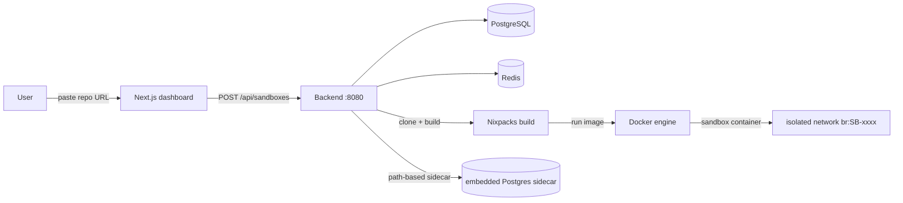
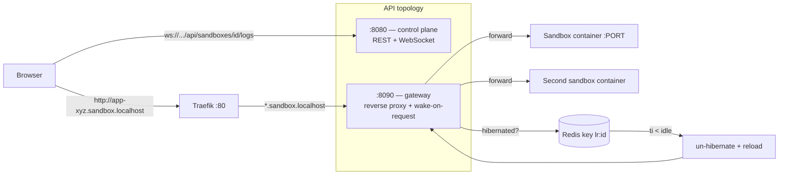

# Architecture

## End-to-end data flow



## Editors & request routing — two separate listeners



Note the split: sandbox traffic flows `:80 → Traefik → :8090 gateway → container`. The `:8080` API only serves the control plane (REST + live log/metric WebSockets).

## Why a gateway instead of per-container Traefik labels?

The Docker provider is unreliable against modern daemons (Traefik 3.1 pins API `1.24`; Docker 29 requires `>= 1.44`), so routing is driven entirely by the **file provider** in `traefik/dynamic.yml`:

```yaml
rule: HostRegexp(`^[a-z0-9-]+\.sandbox\.localhost$`)
service: host.docker.internal:8090   # the backend's gateway listener
```

- Per-sandbox direct Traefik labels remain as a **fallback** and are not used.
- `docker-compose.dev.yml` sets `extra_hosts: host.docker.internal:host-gateway`, so Traefik (a container) can reach the host's `:8090`.
- The gateway resolves the subdomain, **wake-on-request** (below), then reverse-proxies to the container's `PORT` port over the sandbox bridge network.

## Wake-on-request (hibernation)

- The idle reaper expires a Redis key `lr:<sandbox_id>` each time the gate knows the sandbox is receiving traffic (TTL = `idle_timeout_seconds`, default 900).
- A reaper walks sandboxes; when the key has expired it **stops the container** and marks the sandbox `hibernated` (state is preserved in the volume → next wake is fast).
- The gateway intercepts any request to a `hibernated` sandbox, **restarts the container** (verifies DB readiness via `/` + TCP poll with `WaitHealthy`, up to timeout), flips status back to `running`, then forwards the request. Both paths log lines through the same frames channel so the terminal shows boot logs even for the waking request.

## Build pipeline (Nixpacks)

1. `orchestrator.BuildSandbox`: shallow `git clone --depth=1` of `repo_url@branch`, copies env & database preferences into the phase.
2. `exec nixpacks build --name <subdomain> <dir>` (env var `NIXPACKS_BIN` points at the host binary; nixpacks uses the Docker engine to bake the image). First build per provider installs the Nix environment (slow); later builds are incremental and fast.
3. `db.CreateDeployment` records `initial` → `success`/`failed`, with a `log_excerpt` tail for the dashboard.

The base OS is pinned by a nixpacks provider so applications run as written. A **postgres/mysql** sidecar is spawned on a path-based prefix (`/db-pgsql-<subdomain>/`) when the app declares a database dependency.

## Containers

| Property | Value |
|---|---|
| Image | `sandbox/<subdomain>:latest` (nixpacks output) |
| Network | named bridge `br:<id-first-12>` |
| Volume | `sandbox_data_<id>` mounted at `/app` (persists across redeploys; holds the working tree the editor and git see) |
| Ports | none published — only reachable via the gateway over the internal network |
| Limits | CPU 0.5, memory 256 MiB (defaults), `PidsLimit` set; restart never configured (idle/hibernate controlled by reapers) |

## Reapers (worker goroutines)

- **Lifetime reaper** — destroys sandboxes past `expires_at` (why syncing edits is important: this is the deadline).
- **Idle reaper** — hibernates sandboxes whose Redis `lr:` key lapsed.
- **Warnings reaper** — writes lifetime-warning rows for stages `24h`/`1h`/`5m` and the 50th/25th percentiles when >5 sandboxes.
- **Stats flusher** — every 30s queries docker `stats` for each running sandbox, stores snapshots (historical charts), and pushes each snapshot to the stats WebSocket.

## Security posture

- Cookie `asl_session` = AES-GCM-encrypted GitHub ID (key from `SECRETS_ENCRYPTION_KEY`). Session-gated endpoints decrypt the cookie and require the sandbox to belong to the current user.
- Fork → ownership changes to the forker; parent workdir copied by reference (`cp --reflink` or plain copy) into the new volume.
- Destroys cascade: container, volume, network, deployments & snapshots pruning; `TeardownSandbox` never leaves orphaned resources.
- All edits to the working tree are committed only on an explicit **new branch** (`sandbox-edits-<subdomain>`) unless the user opts into `direct_to_original` + force.

## Tech stack

- Go 1.25, `chi` router, GORM (Postgres), `radix` (Redis), `go-git` (clone/push), docker Go SDK (v28-compatible API shapes), gorilla-style `nhooyr/websocket`.
- Next.js 16 App Router (typed routes / `PageProps`), Tailwind v4, `@monaco-editor/react`, `@xterm/xterm`, `recharts`, TanStack Query.